<p align="center">
  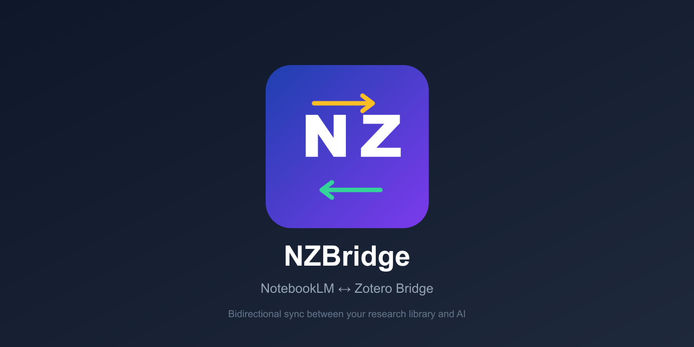
</p>


---

NZBridge enables **bidirectional sync** between [Zotero](https://www.zotero.org/) and [Google NotebookLM](https://notebooklm.google.com/). Push your research library into NotebookLM for AI-powered analysis, then pull your generated notes back into Zotero — all without leaving your browser.

## Demo

[](https://www.youtube.com/watch?v=RCJhwf-Kwto)

> See NZBridge in action — full walkthrough of forward sync, backward sync, and the Zotero plugin installation.

## Features

### Forward Sync (Zotero -> NotebookLM)
- **PDF upload** — Local PDF attachments are uploaded directly to NotebookLM as sources via drag-and-drop
- **URL sources** — Items without local files are synced as web sources using their best available URL
- **Batch processing** — Multiple URLs are pasted in a single operation
- **Auto-naming** — New notebooks are automatically named after the Zotero collection
- **Duplicate detection** — Already-synced items are skipped (per collection-notebook pair)
- **50-source limit** — Warns if a collection exceeds NotebookLM's per-notebook limit

### Backward Sync (NotebookLM -> Zotero)
- **Note extraction** — Scrapes saved notes from NotebookLM's Studio panel
- **Rich content** — Captures full note body text, not just titles
- **Smart navigation** — Clicks into each note's detail view, scrapes content, then navigates back
- **Parent items** — Creates proper Zotero document items (compatible with Notion sync using tools such as Notero)
- **Tags** — Automatically adds default tags (`n2z`, `NotebookLM`), notebook name, note type, and custom user tags
- **Overwrite support** — Re-importing updates existing notes instead of creating duplicates

### Robust UI
- **Collapsed layout support** — Works on both wide (3-column) and narrow/vertical (tabbed) NotebookLM layouts
- **Collection browser** — Hierarchical collection tree with item counts
- **Select/deselect notes** — Choose which notes to import
- **Mapping management** — View and manage collection-notebook mappings
- **Reset sync state** — Clear sync history to re-sync items

## Requirements

Before installing NZBridge, make sure you have:

- **Zotero 7.0 or later** — Download from [zotero.org](https://www.zotero.org/download/)
- **Google Chrome or Microsoft Edge** (version 116+) — Manifest V3 support is required
- **A Google account** with access to [NotebookLM](https://notebooklm.google.com/)

## Installation

NZBridge has **two components** that work together — you need to install both:

| Component | What it does |
|-----------|-------------|
| **Zotero Plugin** | Runs inside Zotero, exposing your collections and items via a local HTTP server |
| **Browser Extension** | Runs in Chrome/Edge, providing the popup UI and automating sync with NotebookLM |

### Step 1 — Install the Zotero Plugin

1. Download the latest `nz-bridge.xpi` file from the [Releases](https://github.com/Rafael-Silva-Oliveira/NZBridge/releases) page

   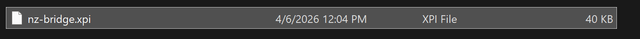

2. Open Zotero and go to **Tools > Plugins**

   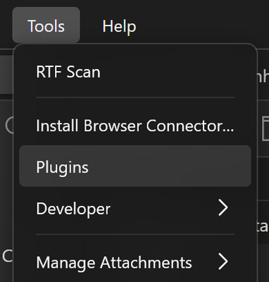

3. In the Plugins Manager, click the **gear icon** (⚙) in the top-right corner

   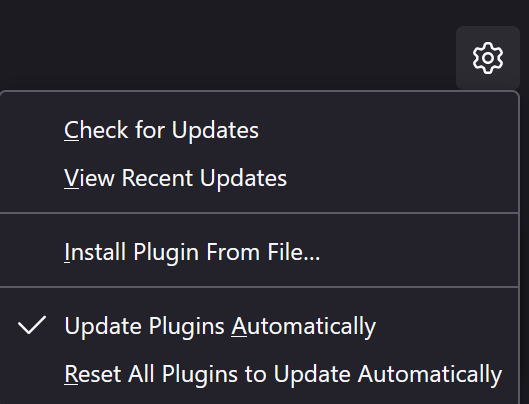

4. Select **Install Plugin From File...**

5. Browse to the downloaded `nz-bridge.xpi` file and click **Open**

6. NZBridge will appear in the Plugins Manager as enabled — restart Zotero if prompted

   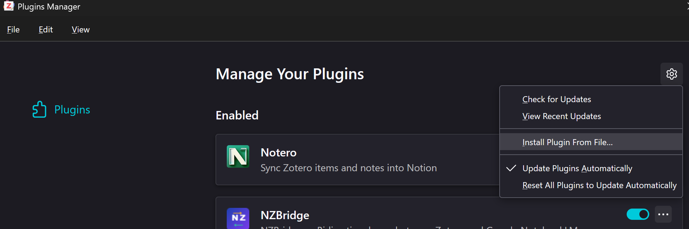

The plugin starts a local HTTP server automatically whenever Zotero is running. No additional configuration is needed.

> **Building from source** (optional):
> ```bash
> cd zotero-plugin
> npm install
> npm run build
> ```
> The built `.xpi` will be at `zotero-plugin/.scaffold/build/nz-bridge.xpi`

### Step 2 — Install the Browser Extension

#### Option A: From the store (recommended)
- **Edge**: Install from the [Edge Add-ons Store] - Coming soon!
- **Chrome**: Coming soon on the Chrome Web Store

#### Option B: Load unpacked (for development)
1. Download or clone this repository
2. Open your browser and navigate to the extensions page:
   - **Chrome**: `chrome://extensions/`
   - **Edge**: `edge://extensions/`
3. Enable **Developer mode**
4. Click **Load unpacked**
5. Select the `browser-extension/` folder from this repository (unzip the `Source code (zip)` file in the releases)
6. The NZBridge icon will appear in your toolbar — pin it for easy access

## Usage

### Forward Sync — Push sources from Zotero to NotebookLM

Upload PDFs and URLs from a Zotero collection as sources in a NotebookLM notebook.

1. Make sure **Zotero is running** with the NZBridge plugin installed
2. Open [NotebookLM](https://notebooklm.google.com/) in your browser and create or open a notebook
3. Click the **NZBridge extension icon** in your toolbar
4. In the **"To NotebookLM"** tab, select a Zotero collection from the dropdown
5. Review the item preview — it shows how many PDFs and URLs will be synced

   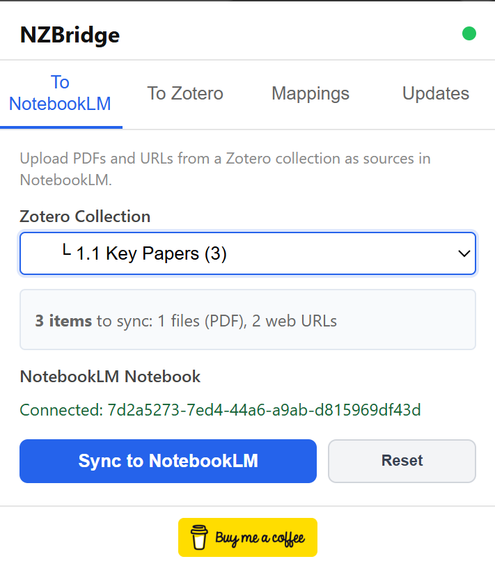

6. Click **"Sync to NotebookLM"** — the progress bar will show the current status

   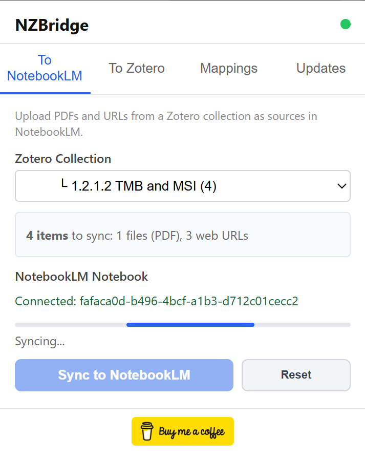

7. NZBridge will automatically:
   - Name the notebook after your Zotero collection (if untitled)
   - Upload local PDFs via drag-and-drop
   - Paste URLs as web sources in batch
   - Skip any items already synced

   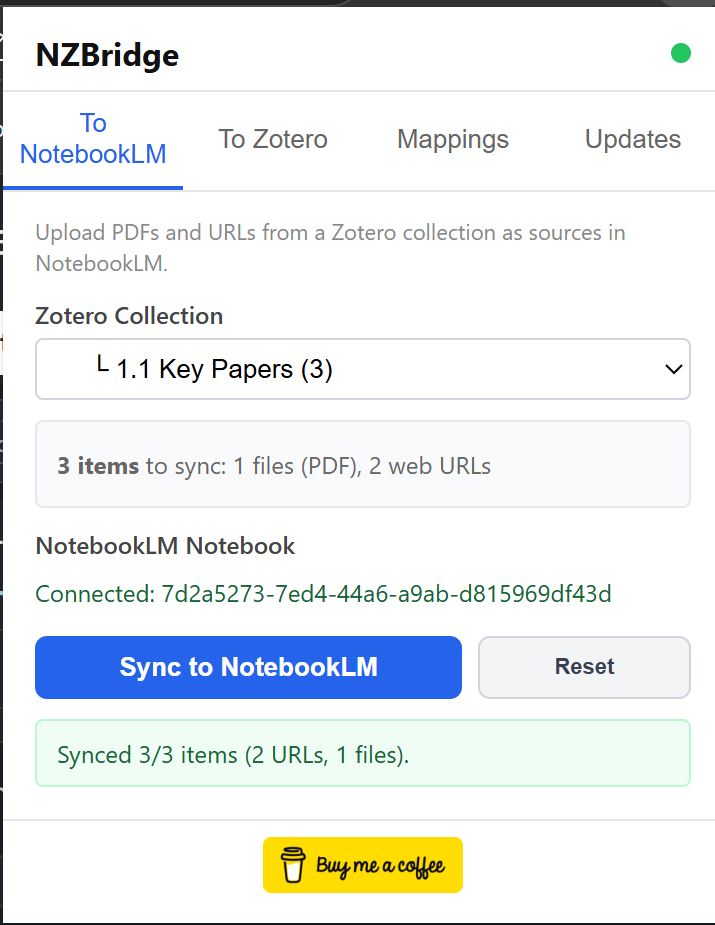

8. Your sources now appear in NotebookLM, ready for AI-powered analysis

   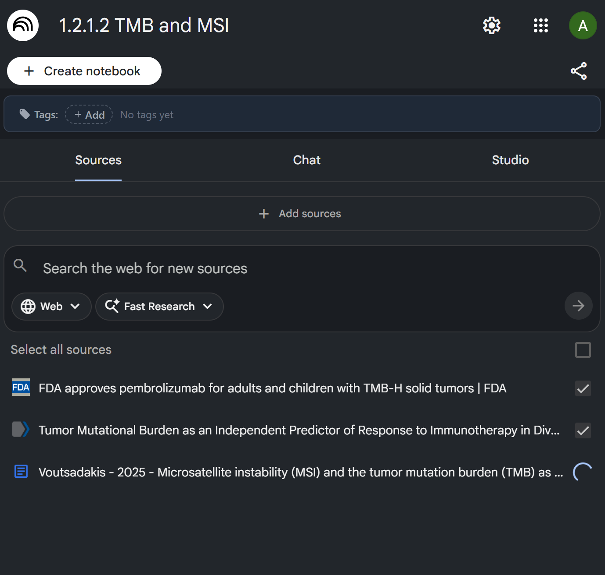

9. You can start chatting with your sources right away

   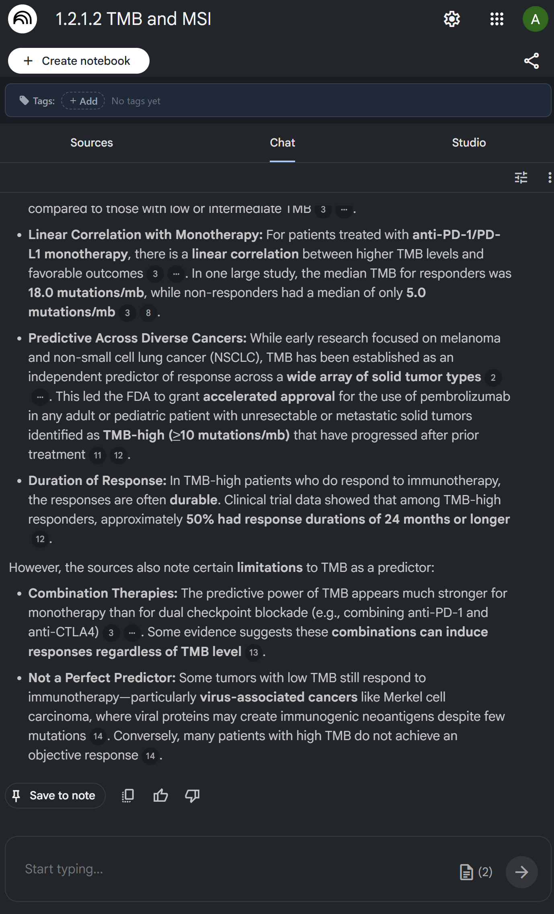

> **Tip:** NotebookLM supports a maximum of **50 sources** per notebook. If your collection is larger, split it into sub-collections.

### Backward Sync — Pull notes from NotebookLM to Zotero

Extract saved notes from NotebookLM's Studio panel and import them into Zotero as document items with child notes.

1. Open a NotebookLM notebook that has **saved notes** in the Studio panel
2. Click the **NZBridge extension icon**
3. Go to the **"To Zotero"** tab
4. Select a **target Zotero collection** from the dropdown
5. Optionally add **custom tags** (comma-separated)
6. Click **"Find Text Notes"** — NZBridge will scan the Studio panel for saved notes
7. Select or deselect individual notes as needed

   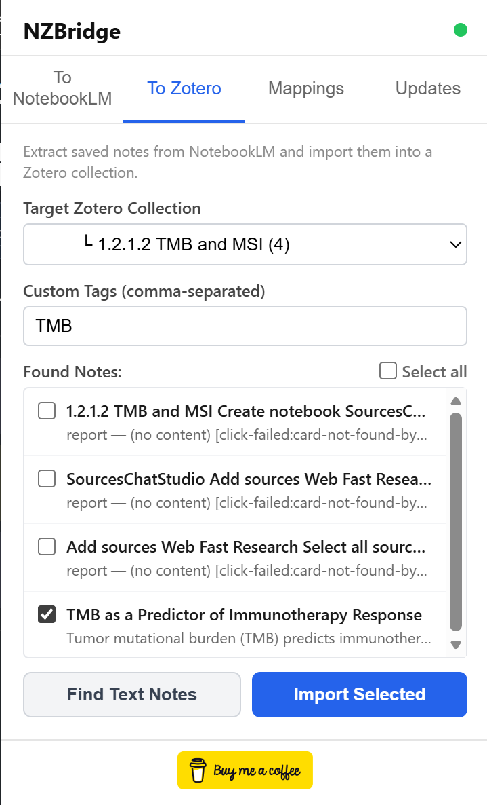

8. Click **"Import Selected"**
9. Each note appears in Zotero as a **Document** parent item with a child note containing the full content

   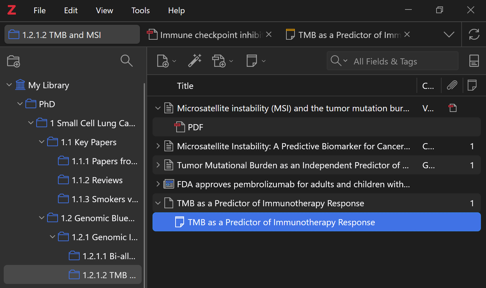

10. The child note contains the complete note text with rich formatting, metadata, and tags

    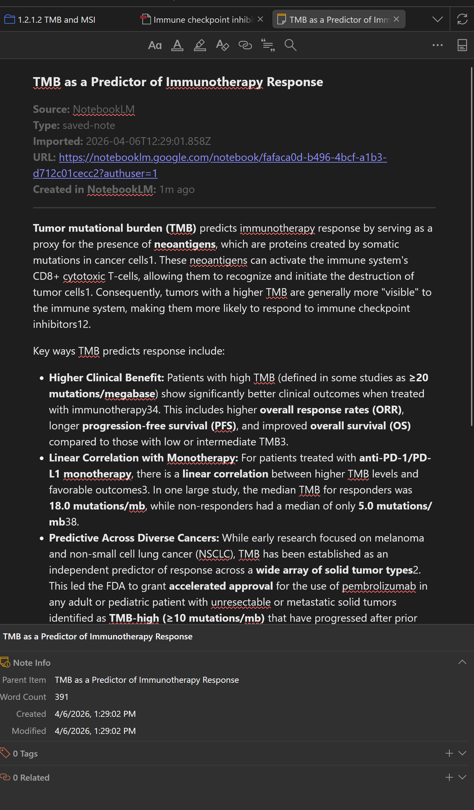

> **Tip:** Imported notes are created as Document parent items, making them compatible with sync tools like [Notero](https://github.com/dvanoni/notero) for Notion integration.

### Managing Mappings

The **"Mappings"** tab shows all collection-notebook links that NZBridge has created. From here you can:
- View which Zotero collection is linked to which NotebookLM notebook
- Delete a mapping to unlink them
- Use the **Reset** button in the "To NotebookLM" tab to clear sync history and re-sync items

## Architecture

| Component | Technology | Purpose |
|-----------|-----------|---------|
| **Zotero Plugin** | Zotero 7/8 plugin (TypeScript) | HTTP server exposing collections, files, and note import API |
| **Browser Extension** | Chrome MV3 extension | UI popup + background service worker that orchestrates sync via DOM scripting |

The browser extension communicates with the Zotero plugin via `localhost:23119` (Zotero's built-in HTTP server).

## Permissions

### Browser Extension
- `activeTab` — Interact with the active NotebookLM tab
- `scripting` — Inject scripts for DOM automation
- `debugger` — Chrome DevTools Protocol for PDF file upload
- `storage` — Persist sync state and mappings

### Zotero Plugin
- Runs an HTTP server on `localhost:23119` (Zotero's built-in connector port)
- Read access to collections, items, and file attachments
- Write access to create/update note items

## Development

### Zotero Plugin
```bash
cd zotero-plugin
npm install
npm run start    # Dev mode with hot reload
npm run build    # Production build
```

### Browser Extension
No build step required — load `browser-extension/` directly as an unpacked extension. Edit files and reload the extension from `chrome://extensions/`.

## Troubleshooting

| Problem | Solution |
|---------|----------|
| Red dot (disconnected) in popup | Make sure Zotero is running with NZBridge installed |
| "Cannot connect to Zotero" error | Check that no firewall is blocking `localhost:23119` |
| PDFs not uploading | Ensure the NotebookLM tab is active and the notebook is open |
| No notes found during import | Open the Studio panel in NotebookLM and make sure you have saved notes (not just chat responses) |
| Sources exceed 50 limit | Split your Zotero collection into smaller sub-collections |

## License

AGPL-3.0-or-later

---

<a href="https://buymeacoffee.com/rafaeloliveira" target="_blank">
  
</a>
